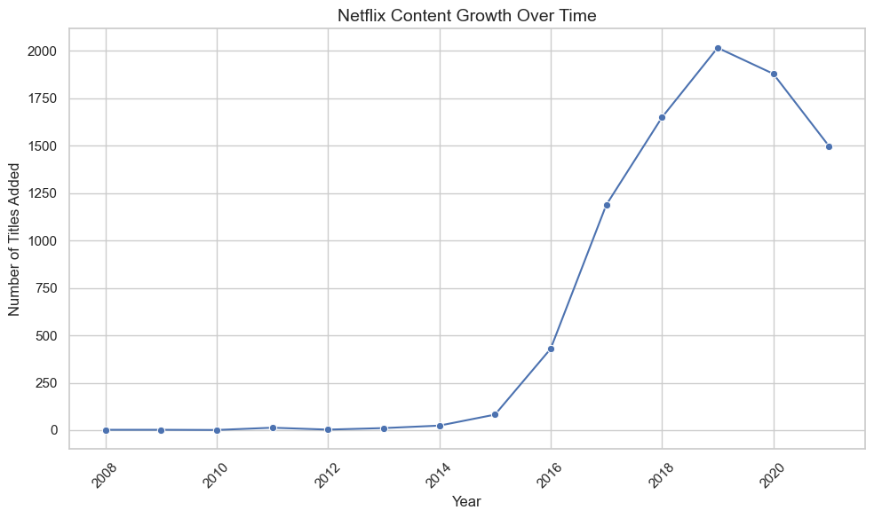
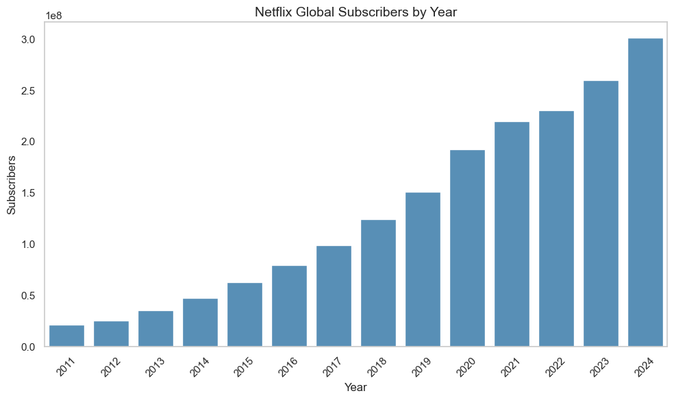
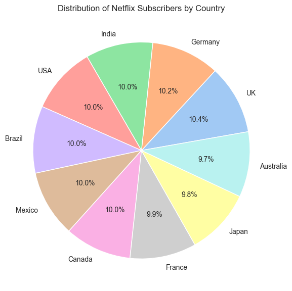

# netflix_analysis

# 🎬 How Netflix Conquered the Global Entertainment Industry

_A Data-Driven Story of Content, Subscribers, and Global Reach_

---

## 📖 Introduction

From a DVD rental company in the early 2000s to a powerhouse in the global streaming market, Netflix has radically transformed how the world watches entertainment.

This project uses real data to explore Netflix’s growth journey by analyzing:

- 📈 The rapid expansion of its content library,
- 🌍 Subscriber trends across countries and over time,
- 🌐 Its global expansion and competition with other platforms.

Whether you're a data enthusiast or a streaming buff, this analysis offers a unique lens into how Netflix became a cultural and business phenomenon.

---

## 📊 Chapters Overview

### 1. **Content Growth**

We analyze how Netflix grew its library of original movies and shows over time. This chapter breaks down the volume and type of content added each year, showing how strategic content production fueled global engagement.

---

### 2. **Subscriber Trends**

This section explores how Netflix’s subscriber base evolved—both in terms of scale and diversity. We visualize global subscriber growth, examine differences in subscription types, and see which countries are most engaged.

---

### 3. **Global Expansion**

Here we explore how Netflix’s presence differs across platforms. From regional dominance to multi-platform content sharing, this chapter uncovers the platform’s international reach and competition.

---

## 🧭 How to Use This Project

- 📂 Navigate to the `notebooks/` folder to explore each chapter:

  - `1_content_growth.ipynb`: Trends in Netflix’s original content
  - `2_subscribers_analysis.ipynb`: Subscriber counts and types
  - `3_global_expansion.ipynb`: Global reach and platform comparison

- 📊 All datasets are available in the `data/` folder.
- 🖼️ Images for charts and visualizations are stored in `images/`.

---

## 🔑 Key Insights

- Netflix’s content production ramped up significantly after 2015, especially in TV series.
- Subscriber numbers surged globally, with a sharp rise post-2016.
- While Netflix dominates, competition from platforms like Amazon Prime Video and Disney+ is strong in some regions.
- Different countries favor different subscription types and content genres, reflecting Netflix’s global adaptation strategy.

---

## 🛠️ Tools Used

- Python (Pandas, Matplotlib, Seaborn)
- Jupyter Notebooks
- Datasets from [Kaggle](https://www.kaggle.com/), cleaned and analyzed
- Git & GitHub

---

## 📌 Project Goal

To showcase the power of **data storytelling** in understanding digital transformation, user behavior, and global market dynamics through Netflix’s lens.

---
